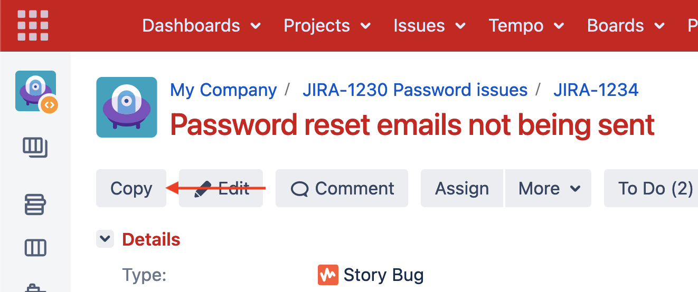
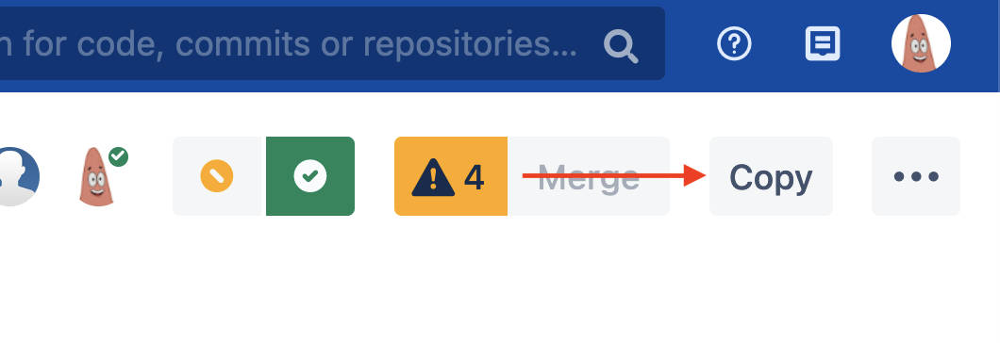

  
  <h1>
    Atlassian Copier
  </h1>
  

    Browser add on which adds copy buttons to Jira (server) and Bitbucket (server) that allow copying ticket/pull request information.
  

## Features

- Copy Jira ticket number and title with a single click
- Jira ticket number includes link to ticket
- Copy Bitbucket pull request title and link with a single click
- Keyboard shorcuts (hover over copy buttons to see them)

## Usage

### Jira

1. Select the Copy button (or keyboard shortcut)
   
   
2. Paste wherever you'd like
   
   

### Bitbucket

1. Select the Copy button (or keyboard shortcut)
   
   
   
2. Paste wherever you'd like

   

## Installation

[Firefox](https://addons.mozilla.org/en-GB/firefox/addon/atlassian-copier/)

Chrome

## Development

1. Install [web-ext](https://extensionworkshop.com/documentation/develop/getting-started-with-web-ext/)
2. Clone the repo
3. `cd` into it
4. Run `web-ext run`

## Packaging

1. `cd` into directory
2. Run `web-ext build --overwrite-dest`

## What problem does this solve?

To avoid situations like this:

- What are your thoughts on JIRA-1234?
- Today I'm working on JIRA-4321
- I'm blocked on JIRA-4521
- Can you help me with JIRA-4984?

Unless the recipient of these messages has memorised what every single ticket relates to, chances are they will need to do the following to have some context:

1. Open up Jira
2. Navigate to the search box
3. Paste in the ticket number
4. Click on the ticket
5. Read the ticket title

With the Atlassian Copier, instead of the sender copying just the ticket number, they can now select Copy (or use the keyboard shortcut) and paste the output. Notice how the recipient now avoids needing to perform the above tedious tasks. If the recipient needs more information, they can immediately click on the ticket link.

- What are your thoughts on [JIRA-1234](link) Password reset emails not sent?
- Today I'm working on [JIRA-4321](link) Change home page background colour
- I'm blocked on [JIRA-4521](link) Login requests timing out
- Can you help me with [JIRA-4984](link) App receiving server error on registration?

## TODO

- [ ] Support Cloud Jira
- [ ] Support Cloud Bitbucket
- [ ] Maybe other services like azure, gitlab etc
